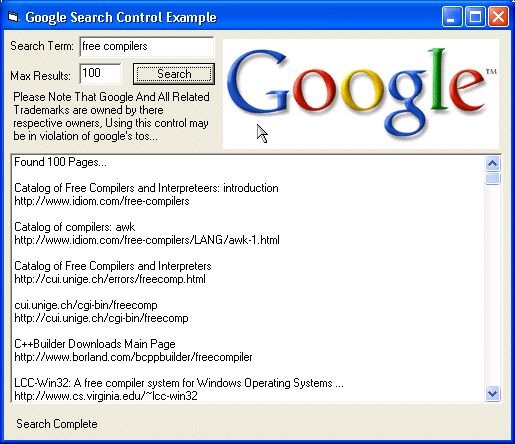



## Google Search

### Description

Google Search Control !! Easy Drop-in Solution For Programmer's... Easily search google from your vb application, no restricting number of search limits and up to 100 results per search!! You dont need any extra controls (such as mswinsck.ocx) to use this control... Enjoy! :) ***Updated!! 11/6/03 Now uses no extra controls for downloading!! urls are better parsed and show as they should!! ***
 
### More Info
 

             |
---                |---
**Submitted On**   |2003-11-06 10:10:28
**By**             |[Deth](https://github.com/Planet-Source-Code/PSCIndex/blob/master/ByAuthor/deth.md)
**Level**          |Intermediate
**User Rating**    |4.7 (14 globes from 3 users)
**Compatibility**  |VB 6\.0
**Category**       |[Internet/ HTML](https://github.com/Planet-Source-Code/PSCIndex/blob/master/ByCategory/internet-html__1-34.md)
**World**          |[Visual Basic](https://github.com/Planet-Source-Code/PSCIndex/blob/master/ByWorld/visual-basic.md)
**Archive File**   |[Google\_Sea1668441162003\.zip](https://github.com/Planet-Source-Code/deth-google-search__1-47728/archive/master.zip)

